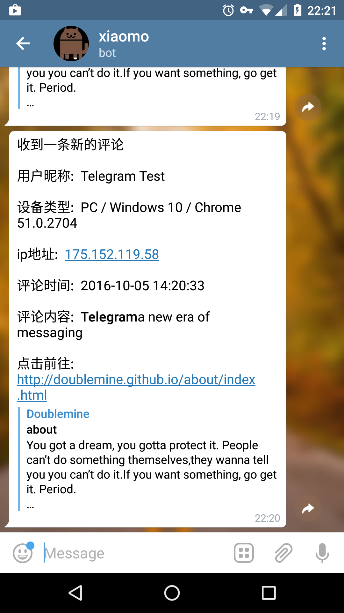

# TelegramBot
基于Telegram的多说评论自动提醒机器人

**本应用的运行依赖于[Telegram](https://telegram.org/)，如果你不知道这是什么或者无法访问这个网站，那么你可以不用往下看了。**

### 作用

由于多说不稳定的评论推送、以及只有对方回复了你的评论你才会收到邮件提醒而对方如果主动留言评论的话不会有邮件提醒的这个设定。导致可能每隔一段时间
都要主动的查看博客的留言很是麻烦（虽然也没啥人留言评论。。。）于是有了这样的东东。。

>本应用能够实现当用户主动评论或者回复评论时，主动通过Telegram推送消息给你以便你查看浏览回复。

目前效果如下:

能够实现用户评论博客文章时，Telegram自动push消息通知。

### 配置

- Fork 此项目或者Clone一份源码到本地，打开`default_config.py`，填入相关参数。
- 将修改后的项目提交并push到github你自己的仓库中。
- 注册一个[LeanCloud帐号](https://leancloud.cn/) 并切换到`美国节点`再创建一个应用，使用其中的云引擎部署，填入你自己的github地址部署完成即可。
- 在LeanCloud云引擎设置中设定一个web主机名
- 打开多说后台配置，在`工具`--`反向同步`--`本地服务器Api地址`中填入你的`Web主机名/ds`,例如:https://doublemine.avosapps.us/ds
- 打开你创建的Telegram Bot 聊天界面，输入你的多说`Short Name`或者`/bind`完成多说评论推送绑定到你当前的Telegram账户。至此配置就完成了。

#### 参数说明

`default_config.py`中相关参数说明:

`IS_USE_SYSTEM_VARIABLE` ： 是否使用系统变量，如果你担心自己的配置信息因为写在项目中因为Github的开源而泄露，那么可以将此项设置为True，项目将从运行项目的系统环境中读取相关配置，否则，将读取`default_config.py`中的配置信息。
对于系统变量的设置，参见LeanCloud: `云引擎`-->`设置`-->`自定义环境变量`

##### 如果`IS_USE_SYSTEM_VARIABLE`为True，`default_config.py`中以下参数将不会被读取，请按照参数名以Key-Value的形式自定义添加到Leancloud的自定义环境变量中。

`DO_TELEGRAM_BOT_TOKEN `： 创建Telegram机器人Token，如何创建[@BotFather](https://telegram.me/BotFather)

`DO_TELEGRAM_BOT_URL`  ： 设置机器人WebHook的回调URL，在本项目中为项目运行的主机域名+“/bot”，例如:https://doublemine.avosapps.us/bot

`DO_TELEGRAM_BOT_NAME`： Telegram机器人的名字

`DO_DS_ID `： 多说用户id，如何查看自己的用户id[查看多说用户Id](http://www.isiyuan.net/?post=43)

`DO_DS_SHORT_NAME ` ： 多说Short name， 配置过Hexo的应该不陌生

`DO_DS_SECRET ` ： 多说的Secret Key

`HOST_NAME ` ： 应用运行的主机域名

### TODO-LIST

- 不需要绑定Telegram Chat id的定向推送
- 实现在机器人聊天内回复
